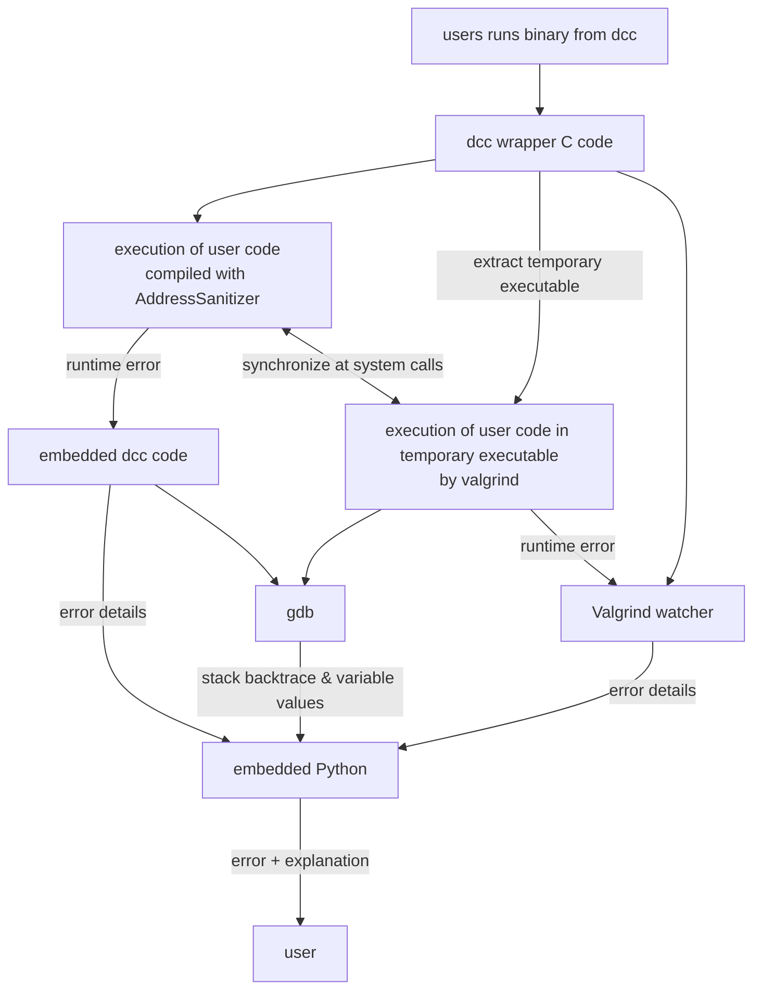

# mermaid-test

```mermaid
flowchart
    user1[users runs binary from dcc] --> main
    main[dcc wrapper C code] -->  Sanitizer1[execution of user code<br>compiled with AddressSanitizer]
    main --> |extract temporary executable| Sanitizer2[execution of user code in temporary executable<br>by valgrind]
    main --> Watcher[Valgrind watcher]
    
    Sanitizer1 --> |runtime error| embedded_C[embedded dcc code]
    Sanitizer1 <--> | synchronize at system calls | Sanitizer2
    embedded_C --> |error details| embedded_Python
    embedded_C --> gdb

    Watcher --> |error details| embedded_Python
    Sanitizer2 --> gdb
    Sanitizer2 --> |runtime error| Watcher
    gdb --> |stack backtrace & variable values| embedded_Python[embedded Python]
    embedded_Python ---> |error + explanation| user2[user]
```
