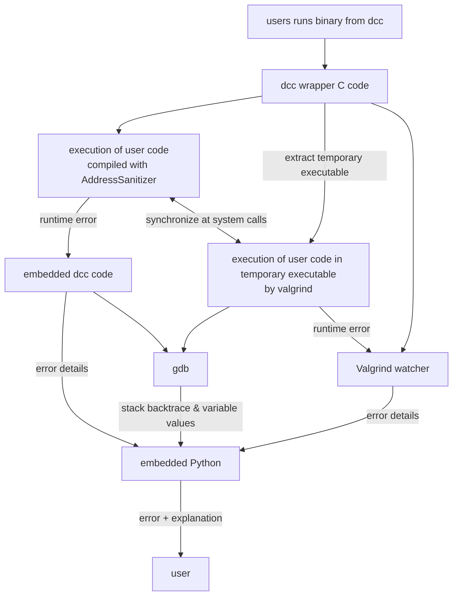
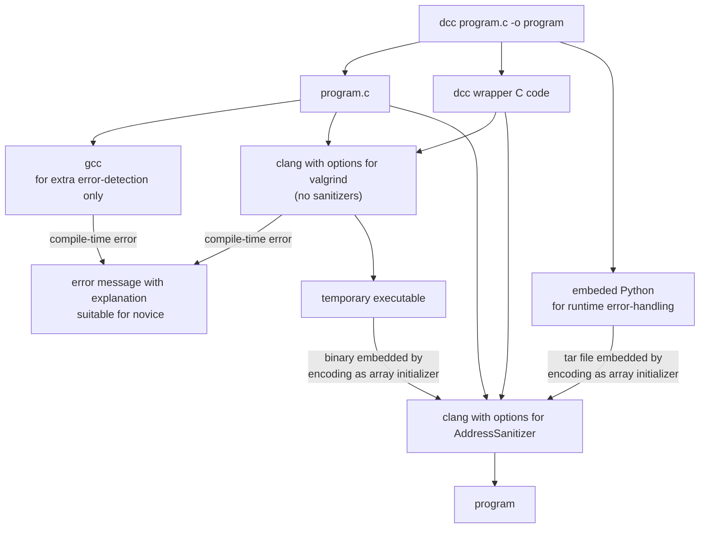

# mermaid-test

```mermaid
flowchart
    user1[users runs binary from dcc] --> main
    main[dcc wrapper C code] -->  Sanitizer1[execution of user code<br>compiled with AddressSanitizer]
    main --> |extract temporary executable| Sanitizer2[execution of user code in temporary executable<br>by valgrind]
    main --> Watcher[Valgrind watcher]
    
    Sanitizer1 --> |runtime error| embedded_C[embedded dcc code]
    Sanitizer1 <--> | synchronize at system calls | Sanitizer2
    embedded_C --> |error details| embedded_Python
    embedded_C --> gdb

    Watcher --> |error details| embedded_Python
    Sanitizer2 --> gdb
    Sanitizer2 --> |runtime error| Watcher
    gdb --> |stack backtrace & variable values| embedded_Python[embedded Python]
    embedded_Python ---> |error + explanation| user2[user]
```

```mermaid
flowchart
    dcc[dcc program.c -o program] --> user_code[program.c]
    user_code --> gcc[gcc<br>for extra error-detection only]
    gcc --> |compile-time error| explanation
    dcc --> wrapper_code[dcc wrapper C code]
    dcc --> embedded_Python[embeded Python<br>for runtime error-handling]
    user_code --> clang1["clang with options for valgrind<br>(no sanitizers)"]
    wrapper_code --> clang1
    clang1 --> |compile-time error| explanation[error message with explanation<br> suitable for novice]
    clang1 --> temporary_executable[temporary executable]
    wrapper_code --> clang2[clang with options for AddressSanitizer]
    user_code --> clang2
    embedded_Python --> |tar file embedded by<br>encoding as array initializer| clang2
    temporary_executable --> |binary embedded by<br>encoding as array initializer| clang2
    clang2 --> program
```
